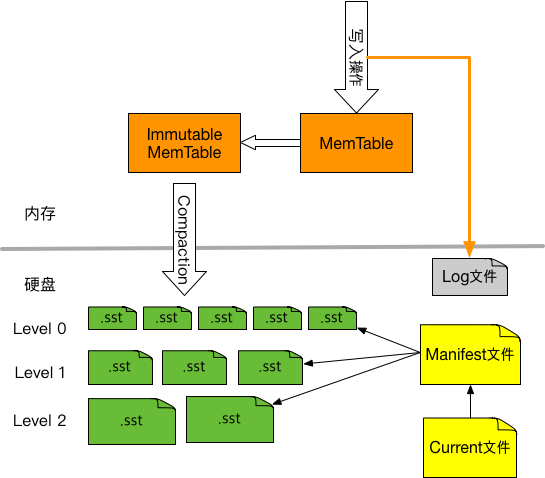

请设计一个Key-Value存储引擎(Design a key-value store)。

这是一道频繁出现的题目，个人认为也是一道很好的题目，这题纵深非常深，内行的人可以讲的非常深。

目前开源的KV存储引擎中，RocksDB是流行的一个，MongoDB和MySQL底层可以换成RocksDB， TiDB底层直接使用了RocksDB，基本上分布数据库的底层不约而同的都选择了RocksDB。

RocksDB最初是从LevelDB进化而来的，我们先从简单一点的LevelDB入手，借鉴它的设计思路。

## LevelDB整体结构

有一个反直觉的事情是，**内存随机写甚至比硬盘的顺序读还要慢**，磁盘随机写就更慢了，说明我们要避免随机写，最好设计成顺序写。因此好的KV存储引擎，都在尽量避免更新操作，把更新和删除操作转化为顺序写操作。LevelDB采用了一种SSTable的数据结构来达到这个目的。

SSTable(Sorted String Table)就是一组按照key排序好的 key-value对, key和value都是字节数组。SSTable既可以在内存中，也可以在硬盘中。SSTable底层使用LSM Tree(Log-Structured Merge Tree)来存放有序的key-value对。

LevelDB整体由如下几个组成部分，

1. MemTable。即内存中的SSTable，新数据会写入到这里，然后批量写入磁盘，以此提高写的吞吐量。
1. Log文件。写MemTable前会写Log文件，即用WAL(Write Ahead Log)方式记录日志，如果机器突然掉电，内存中的MemTable丢失了，还可以通过日志恢复数据。WAL日志是很多传统数据库例如MySQL采用的技术，详细解释可以参考[数据库如何用 WAL 保证事务一致性？ - 知乎专栏](https://zhuanlan.zhihu.com/p/24900322)。
1. Immutable MemTable。内存中的MemTable达到指定的大小后，将不再接收新数据，同时会有新的MemTable产生，新数据写入到这个新的MemTable里，Immutable MemTable随后会写入硬盘，变成一个SST文件。
1. `SSTable`文件。即硬盘上的SSTable，文件尾部追加了一块索引，记录key->offset，提高随机读的效率。SST文件为Level 0到Level N多层，每一层包含多个SST文件；单个SST文件容量随层次增加成倍增长；Level0的SST文件由Immutable MemTable直接Dump产生，其他Level的SST文件由其上一层的文件和本层文件归并产生。
1. Manifest文件。 Manifest文件中记录SST文件在不同Level的分布，单个SST文件的最大最小key，以及其他一些LevelDB需要的元信息。
1. Current文件。从上面的介绍可以看出，LevelDB启动时的首要任务就是找到当前的Manifest，而Manifest可能有多个。Current文件简单的记录了当前Manifest的文件名。

LevelDB的一些核心逻辑如下，

1. 首先SST文件尾部的索引要放在内存中，这样读索引就不需要一次磁盘IO了
1. 所有读要先查看`MemTable`，如果没有再查看内存中的索引
1. 所有写操作只能写到`MemTable`, 因为SST文件不可修改
1. 定期把`Immutable MemTable`写入硬盘，成为`SSTable`文件，同时新建一个`MemTable`会继续接收新来的写操作
1. 定期对`SSTable`文件进行合并
1. 由于硬盘上的`SSTable`文件是不可修改的，那怎么更新和删除数据呢？对于更新操作，追加一个新的key-value对到文件尾部，由于读`SSTable`文件是从前向后读的，所以新数据会最先被读到；对于删除操作，追加“墓碑”值(tombstone)，表示删除该key，在定期合并`SSTable`文件时丢弃这些key, 即可删除这些key。

## Manifest文件

Manifest文件记录各个SSTable各个文件的管理信息，比如该SST文件处于哪个Level，文件名称叫啥，最小key和最大key各自是多少，如下图所示，

## Log文件

Log文件主要作用是系统发生故障时，能够保证不会丢失数据。因为在数据写入内存中的MemTable之前，会先写入Log文件，这样即使系统发生故障，MemTable中的数据没有来得及Dump到磁盘，LevelDB也可以根据log文件恢复内存中的MemTable，不会造成系统丢失数据。这个方式就叫做 WAL(Write Ahead Log)，很多传统数据库例如MySQL也使用了WAL技术来记录日志。

每个Log文件由多个block组成，每个block大小为32K，读取和写入以block为基本单位。下图所示的Log文件包含3个Block，

### SSTable

## MemTable

MemTable 是内存中的数据结构，存储的内容跟硬盘上的SSTable一样，只是格式不一样。Immutable MemTable的内存结构和Memtable是完全一样的，区别仅仅在于它是只读的，而MemTable则是允许写入和读取的。当MemTable写入的数据占用内存到达指定大小，则自动转换为Immutable Memtable，等待Dump到磁盘中，系统会自动生成一个新的MemTable供写操作写入新数据，理解了MemTable，那么Immutable MemTable自然不在话下。

MemTable里的数据是按照key有序的，因此当插入新数据时，需要把这个key-value对插入到合适的位置上，以保持key有序性。MemTable底层的核心数据结构是一个跳表(Skip List)。跳表是红黑树的一种替代数据结构，具有更高的写入速度，而且实现起来更加简单，请参考[跳表(Skip List)](appendix/skip-list.md)。

前面我们介绍了LevelDB的一些内存数据结构和文件，这里开始介绍一些动态操作，例如读取，写入，更新和删除数据，分层合并，错误恢复等操作。

## 添加、更新和删除数据

LevelDB写入新数据时，具体分为两个步骤：

1. 将这个操作顺序追加到log文件末尾。尽管这是一个磁盘操作，但是文件的顺序写入效率还是跟高的，所以不会降低写入的速度
1. 如果log文件写入成功，那么将这条key-value记录插入到内存中MemTable。

LevelDB更新一条记录时，并不会本地修改SST文件，而是会作为一条新数据写入MemTable，随后会写入SST文件，在SST文件合并过程中，新数据会处于文件尾部，而读取操作是从文件尾部倒着开始读的，所以新值一定会最先被读到。

LevelDB删除一条记录时，也不会修改SST文件，而是用一个特殊值(墓碑值，tombstone)作为value，将这个key-value对追加到SST文件尾部，在SST文件合并过程中，这种值的key都会被忽略掉。

## 读取数据

## 分层合并(Leveled Compaction)

### 参考资料

* [SSTable and Log Structured Storage: LevelDB - igvita.com](https://www.igvita.com/2012/02/06/sstable-and-log-structured-storage-leveldb/)
* [数据分析与处理之二（Leveldb 实现原理） - Haippy - 博客园](http://www.cnblogs.com/haippy/archive/2011/12/04/2276064.html)
* [Log Structured Merge Trees(LSM) 原理 - OPEN 开发经验库](http://www.open-open.com/lib/view/open1424916275249.html)
* [从朴素解释出发解释leveldb的设计 | ggaaooppeenngg](https://ggaaooppeenngg.github.io/zh-CN/2017/03/31/%E4%BB%8E%E6%9C%B4%E7%B4%A0%E8%A7%A3%E9%87%8A%E5%87%BA%E5%8F%91%E8%A7%A3%E9%87%8Aleveldb%E7%9A%84%E8%AE%BE%E8%AE%A1/index.html)
* [LSM 算法的原理是什么？ - 知乎](https://www.zhihu.com/question/19887265)
* [数据库如何用 WAL 保证事务一致性？ - 知乎专栏](https://zhuanlan.zhihu.com/p/24900322)
* [LevelDB系列概述 - 360基础架构组](http://chuansong.me/n/1509342851514)
